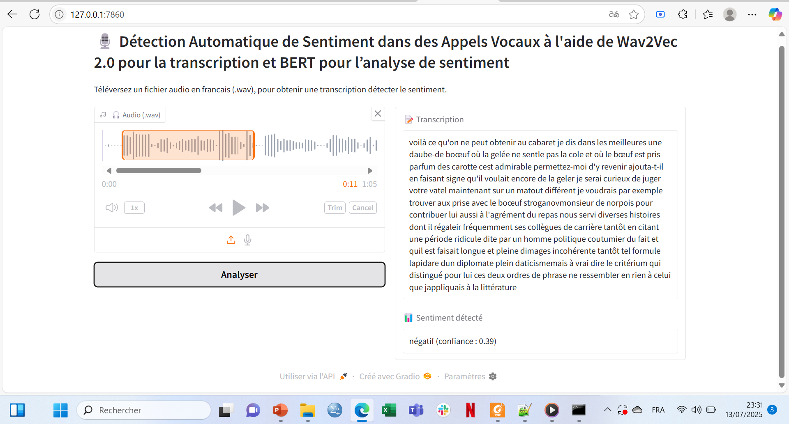
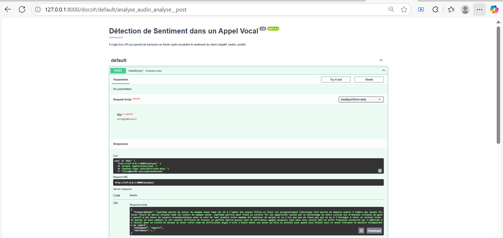

# Projet de détection Automatique de Sentiment dans des Appels Vocaux à l’aide de Wav2Vec 2.0 et BERT

## 👨‍💻 Etudiant
> Projet de Deep Learning  
> Réalisé par : *[MILOUNGOU JEDIDJA WL DUPRET JOYEUX]*  
> Date : Juillet 2025

## Contexte
Les entreprises reçoivent quotidiennement des appels vocaux de clients. Ces appels
contiennent des informations précieuses sur la satisfaction, les frustrations ou les attentes des
clients. Cependant, analyser manuellement des milliers d’heures d’enregistrements est coûteux
et inefficace.

Ainsi, dans ce projet nous implémentons un pipeline Deep Learning capable de :  
✅ Transcrire un audio (.wav) en texte grâce à **Wav2Vec2.0**  
✅ Analyser le sentiment du texte transcrit (négatif, neutre, positif) grâce à **XLM-Roberta (BERT)**  
✅ Proposer deux interfaces : une interface **Gradio** pour tester facilement, et une **API FastAPI** pour une utilisation programmatique.

---
## Contenu du projet
## 📂 Architecture du projet

```
detection_automatique_des_sentiments_DL/
├── api/
│   └── main.py                
├── gradio_app/
│   └── interface.py           
├── pipeline/
│   ├── transcription.py
│   └── text_analysis.py
├── transcriptions/            
├── data/                       
├── requirements.txt
├── README.md
```

---

## 🔗 Modèles utilisés
- [jonatasgrosman/wav2vec2-large-xlsr-53-french](https://huggingface.co/jonatasgrosman/wav2vec2-large-xlsr-53-french) — transcription audio en français.
- [cardiffnlp/twitter-xlm-roberta-base-sentiment](https://huggingface.co/cardiffnlp/twitter-xlm-roberta-base-sentiment) — analyse de sentiment multilingue.

---

## 🛠️ Étapes de reproduction

### 1. Clonnage du dépot git en local
```
git clone https://github.com/jdupret/detection_automatique_des_sentiments_DL.git
cd detection_automatique_des_sentiments_DL
```

### 2. Installation des dépendances
```
pip install -r requirements.txt
```

---

## 🚀 Interfaces

### 🎨 Gradio
```
python gradio_app/interface.py
```

📌 Accession à l’interface via :
http://127.0.0.1:7860

---

### 🌐 API REST (FastAPI)

#### Lancement du serveur
```
uvicorn api.main:app --reload
```

📌 Documentation interactive accessible via :
http://127.0.0.1:8000/docs

---

## 📄 Cas d’usage

### 🖼️ 1. Interface Gradio
)

### 🖼️ 2. API


---

## 📚 Ressources
- [FastAPI Documentation](https://fastapi.tiangolo.com/)
- [Gradio Documentation](https://gradio.app/)
- [HuggingFace Transformers](https://huggingface.co/docs/transformers)

---
